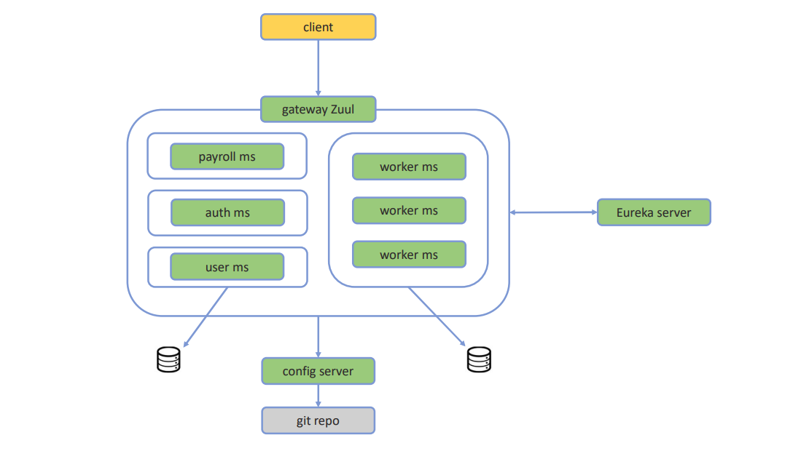

# Human Resources Microservices

HR Microservices is the ecosystem responsible to manager human resources

# Table of contents

- [Architecture](#architecture)
    - [Build requirements](#build-requirements)
    - [Architecture diagram](#architecture-diagram)
    - [Frameworks used](#frameworks-used)
- [Setup](#setup)
    - [How to Build](#how-to-build)
    - [How to Run](#how-to-run)
    - [How to Test](#how-to-test)
- [How to Deploy](#how-to-deploy)


## Architecture

### Architecture diagram



### Build requirements

In order to build and run Gregorio application you need to have some installed:

- Docker 1.x
- JDK 11
- Setup `JAVA_HOME` environment variables with path to JDK 11

### Frameworks used

- [**Spring Boot**](https://github.com/spring-projects/spring-boot)
- [**Spring Cloud**](https://github.com/spring-projects/spring-cloud)
- [**Spring Security**](https://github.com/spring-projects/spring-security)

### How to Build

To build this project, first time you try to build you need to run this:

```sh
make build
```

or if you prefer to use directly gradle you can use

```sh
mvn clean build
```

### How to Run

This projects follow the [code-style](https://github.com/google/google-java-format) defined by the [Google](https://github.com/google). Please check the documentation since the build cannot pass if the codebase does not follow this code-style.


### How to Test

#### Unit tests

In order to run the unit test you just need to run

```sh
make test
```

or if you prefer to use directly gradle you can use

```sh
mvn test
```

## How to Deploy

The deploy not implemented yet.

## Monitoring

The monitoring not implemented yet.

## Code style

Apply Google Java Style.
Download the intellij-java-google-style.xml file from here
`https://raw.githubusercontent.com/google/styleguide/gh-pages/intellij-java-google-style.xml`
